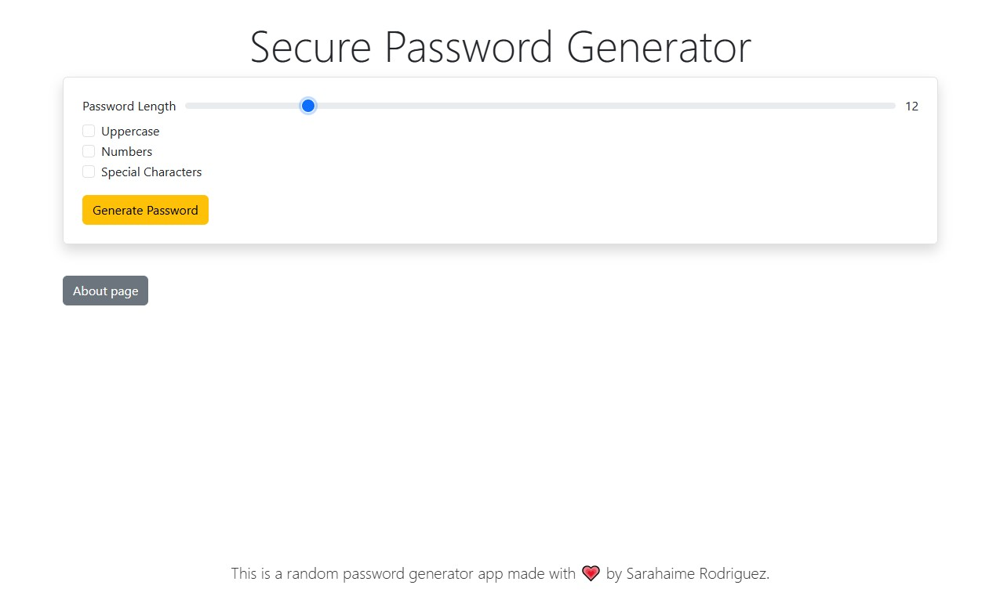
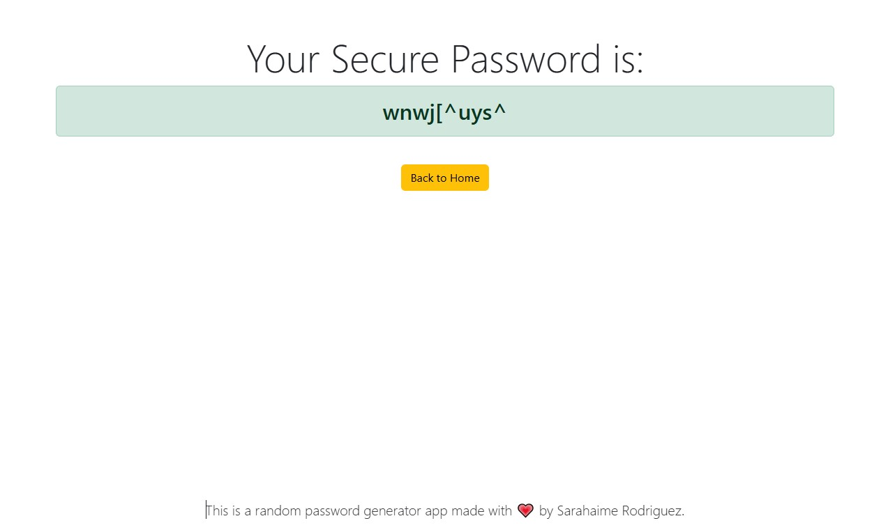
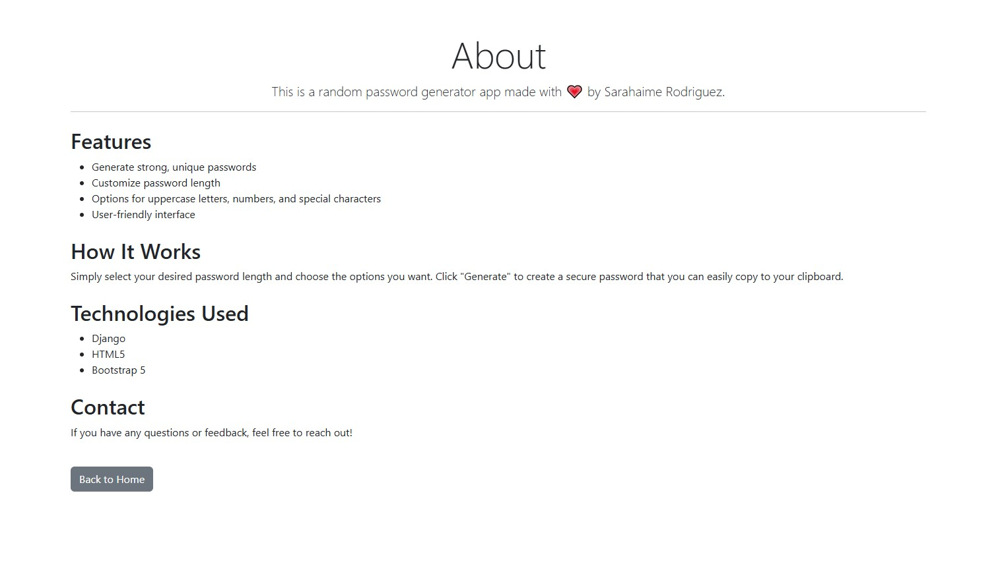

# Password Generator

## Description

This is a simple web application that generates secure and random passwords. It is built using Django and utilizes Bootstrap for styling.

## Features

- Generate random passwords based on user-defined criteria (length, inclusion of special characters and/or uppercase letters)
- User-friendly interface
- Responsive design using Bootstrap

## Screenshots

### Home Page (Password Generation Form)


### Generated Password 


### About Page 



## Installation

### Prerequisites

Ensure you have Python 3 and pip installed on your machine. You can download Python from [python.org](https://www.python.org/downloads/).

### Clone the Repository

```bash
git clone https://github.com/sarahaime/password-generator.git
cd password-generator
```

### Create a Virtual Environment

```bash
python -m venv venv
```

### Activate the Virtual Environment

- **Windows:**

```bash
.\venv\Scripts\activate
```

- **macOS/Linux:**

```bash
source venv/bin/activate
```

### Install Dependencies

```bash
pip install -r requirements.txt
```

## Running the Application

To run the application, use the following command:

```bash
python manage.py runserver
```

Open your web browser and navigate to `http://127.0.0.1:8000/` to access the application.

## Usage

1. Enter the desired criteria for the password (length, special characters, etc.).
2. Click the "Generate" button to create a new password.
3. Copy the generated password for use.


## Acknowledgments

- Django framework
- Bootstrap for styling